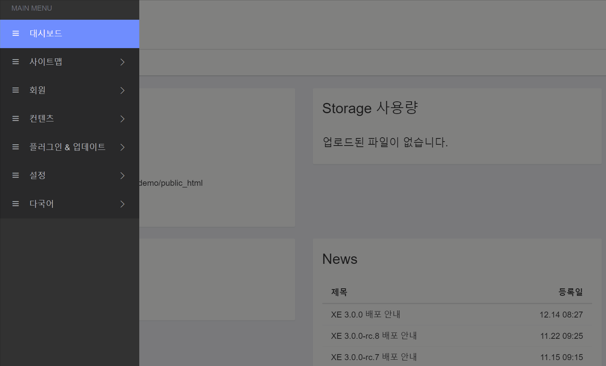
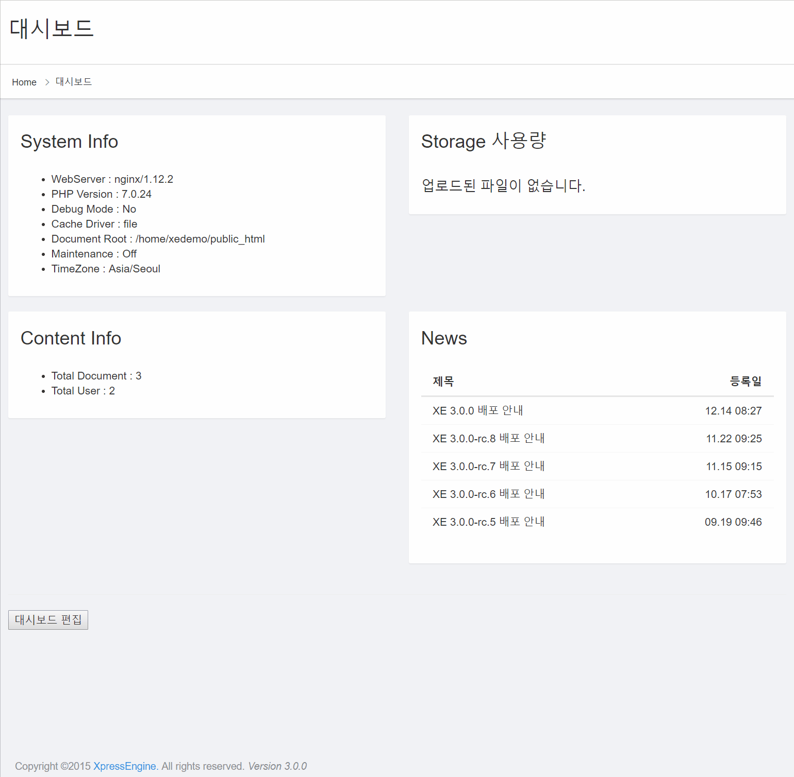

# 회원 정보 수정 / 거부 / 삭제

## 회원을 추가하는 방법

회원 &gt; 회원 목록에서 관리자 인증 후 새 회원 추가를 통해 관리자가 수동으로 회원을 추가할 수 있습니다.

1. `회원 > 회원 목록` 클릭
2. 관리자 인증 후 `새 회원 추가` 클릭
3. 이름, 이메일, 등급, 비밀번호, 그룹을 입력 또는 선택
4. 등록

## 회원을 삭제하는 방법 

회원 &gt; 회원 목록에서 `관리 탭의 삭제` 기능으로 회원을 수동 삭제할 수 있습니다. 회원 삭제는 아래 순서로 가능합니다.

1. 삭제할 회원의 왼쪽 체크 항목 체크
2. 상단의 `선택 삭제` 클릭
3. 삭제 항목에서 삭제 클릭
4. 삭제 완료

## 확장변수를 사용하는 방법 

순수한 회원 기능에 추가 정보를 사이트 \(예 :문의 게시판\)에 유용한 기능입니다. 아래의 수순을 따라 회원 기능에 원하는 추가 정보 또는 데이터를 입력할 수 있습니다.

1. 회원 &gt; 설정 &gt; 확장 필드 설정 을 클릭 합니다.
2. 오른쪽 추가버튼을 누릅니다.
3. 입력할 확장필드의 종류를 선택합니다. \(확장 필드의 정보는 하단에 있습니다.\)
4. 확장 필드의 고유 ID\(회원 확장 필드 ID\)를 입력 후, 라벨\(확장필드의 이름\)을 입력 합니다.
5. 사용할 것인지의 사용 여부와, 필수 여부를 체크한 후, 스킨을 선택하여 등록합니다.
6. 완성!

**확장 필드 종류**

* Category - \(분류/게시글의 종류\)
* Number - \(숫자 유형의 데이터\)
* Text - \(글자 유형의 데이터\)
* boolean - \(불리언 / 참거짓\)
* Address - \(주소/ 동호수\)
* Cell phone number - \(휴대폰 번호\)
* Textarea - \(텍스트 입력 탭\)
* Email - \(이메일 주소\)
* Url - \(링크형태의 주소/자동링크됨\)

## 스킨 설정하는 방법 

스킨을 다르게 하거나, 변경할 수 있습니다.

1. 회원 &gt; 설정 &gt; 스킨 설정을 클릭합니다.
2. 사용할 스킨의 Desktop과 Mobile을 각각 클릭합니다.
3. 놀랍게도 설정 완료!

