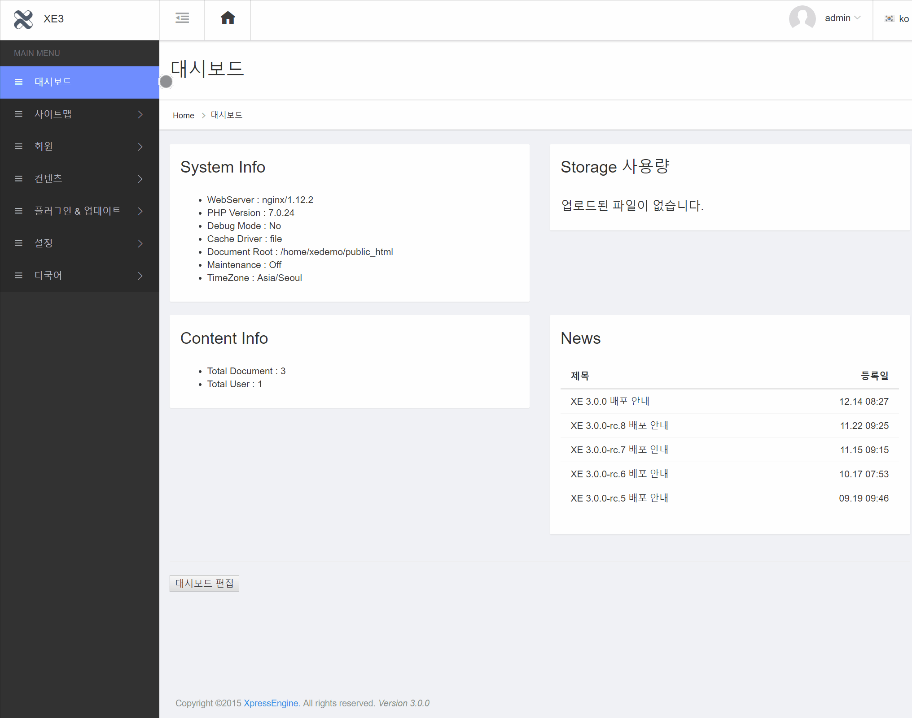
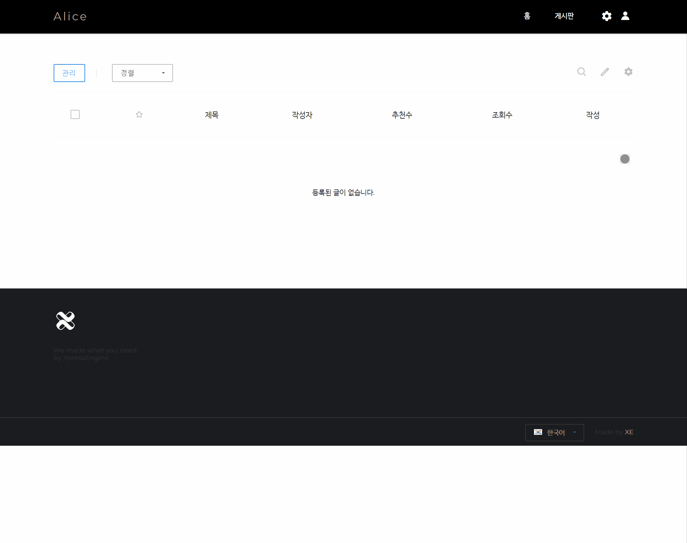

# 게시판 추가 / 삭제 / 설정

## 게시판을 추가하는 방법

관리자 &gt; 사이트 맵&gt; 사이트 메뉴 편집에서 `아이템 추가` 기능으로 게시판을 추가해서 사용합니다. 게시판 추가는 아래 순서로 가능합니다.

## 게시판을 삭제하는 방법

관리자 &gt; 사이트 맵&gt; 사이트 메뉴 편집에서 `아이템 제거` 기능으로 게시판을 삭제할 수 있습니다. 게시판 삭제는 아래 순서로 가능합니다.

## 권한을 설정하는 방법

게시판에 쓰기/읽기/리스트조회/관리자 권한을 부여하거나 제한할 수 있습니다.

## 토글메뉴 관리

게시판에 존재하는 휴지통 기능 또는 신고 토글 메뉴를 관리할 수 있습니다.

## 확장변수를 사용하는 방법

순수한 게시판 기능에 추가 정보를 사용하는 게시판 \(예 :문의 게시판\)에 유용한 기능입니다. 아래의 수순을 따라 게시판에 원하는 추가 정보 또는 데이터를 입력할 수 있습니다.

**확장 필드 종류**

* Category - \(분류/게시글의 종류\)
* Number - \(숫자 유형의 데이터\)
* Text - \(글자 유형의 데이터\)
* boolean - \(불리언 / 참거짓\)
* Address - \(주소/ 동호수\)
* Cell phone number - \(휴대폰 번호\)
* Textarea - \(텍스트 입력 탭\)
* Email - \(이메일 주소\)
* Url - \(링크형태의 주소/자동링크됨\)

## 스킨 설정하는 방법

각 게시판 마다 스킨을 다르게 하거나, 변경할 수 있습니다.

## 출력 순서 변경하는 방법

각 게시판 마다 탭들의 출력 순서, 글을 쓰거나 읽을때의 출력과 입력 순서를 바꿀 수 있습니다.

1. 출력 순서를 변경할 게시판의 설정 버튼을 클릭 합니다.
2. 상단의 탭중 `출력 순서`를 클릭 합니다.
3. 사용하지 않거나 사용할 목록을 설정하고, 출력/입력 순서를 지정합니다.
4. 저장버튼을 눌러 설정 완료!

