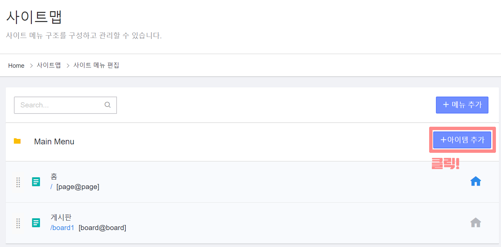
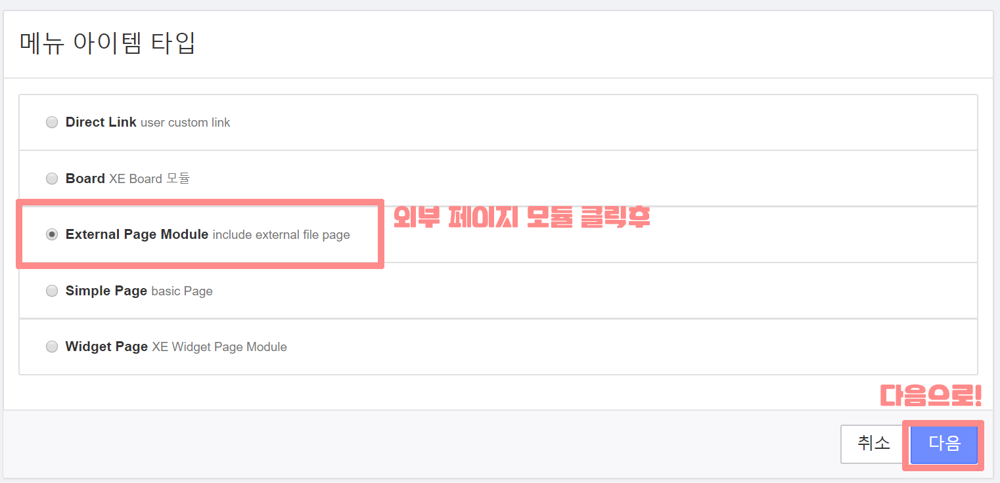
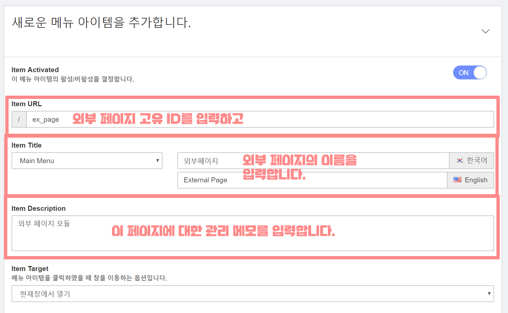

# 외부 페이지 추가 / 삭제 / 설정


본 내용은 기본 플러그인의 내용이 아닙니다.  
본 기능을 사용하기 위해서는 Store에서 외부 페이지 플러그인을 설치, 활성화 이후 작업해주시기 바랍니다.


## 외부 페이지를 추가하는 방법

관리자 &gt; 사이트 맵&gt; 사이트 메뉴 편집에서 `아이템 추가` 기능으로 외부페이지를 추가해서 사용합니다. 외부 페이지는 아래 순서로 가능합니다.

1. `아이템 추가` 클릭
2. External Page Module 선택 후 하단에 `다음` 클릭
3. itemURL, Item Title 등 세부사항 입력
4. 등록

## 외부 페이지를 삭제하는 방법

관리자 &gt; 사이트 맵&gt; 사이트 메뉴 편집에서 `아이템 제거` 기능으로 외부페이지를 삭제할 수 있습니다. 외부 페이지 삭제는 아래 순서로 가능합니다.

1. 삭제할 아이템 이름 클릭
2. 상단의 `아이템 삭제하기` 클릭
3. 아이템 삭제 항목에서 삭제 클릭
4. 삭제 완료

