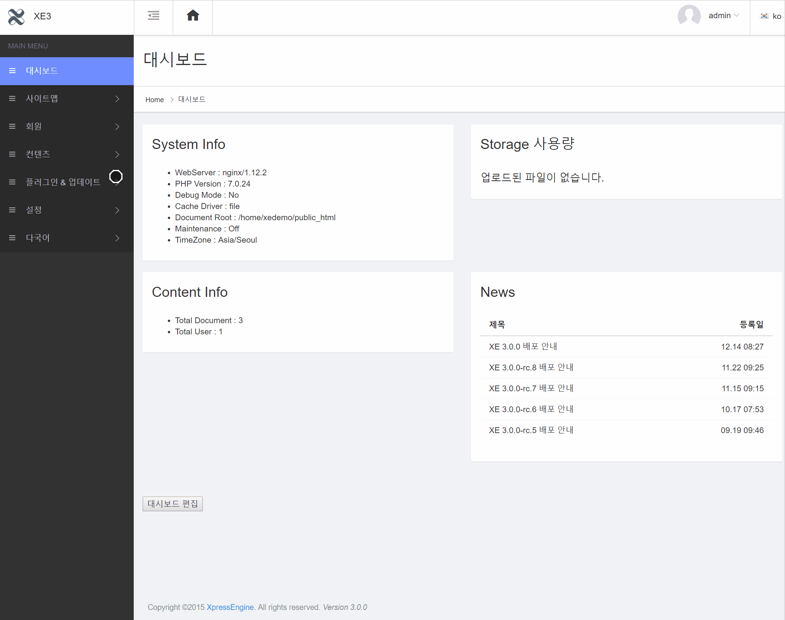

# 심플 페이지 추가 / 삭제 / 설정

## 심플 페이지를 추가하는 방법

관리자 &gt; 사이트 맵&gt; 사이트 메뉴 편집에서 `아이템 추가` 기능으로 심플 페이지를 추가해서 사용합니다. 심플 페이지는 아래 순서로 가능합니다.

## 심플 페이지를 삭제하는 방법

관리자 &gt; 사이트 맵&gt; 사이트 메뉴 편집에서 `아이템 제거` 기능으로 심플 페이지를 삭제할 수 있습니다. 심플 페이지 삭제는 아래 순서로 가능합니다.

