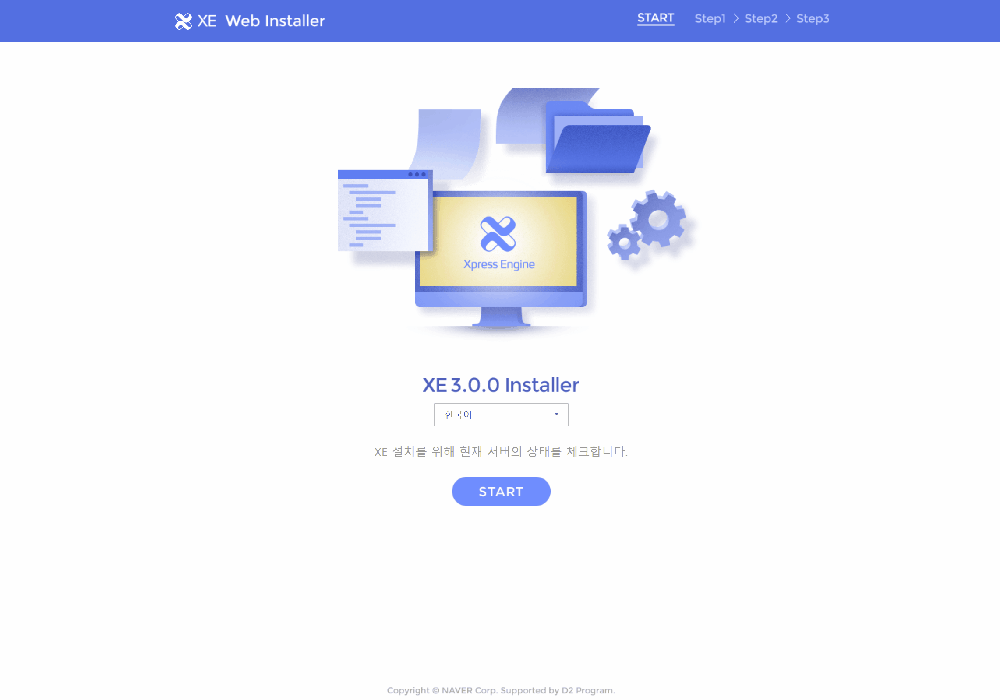
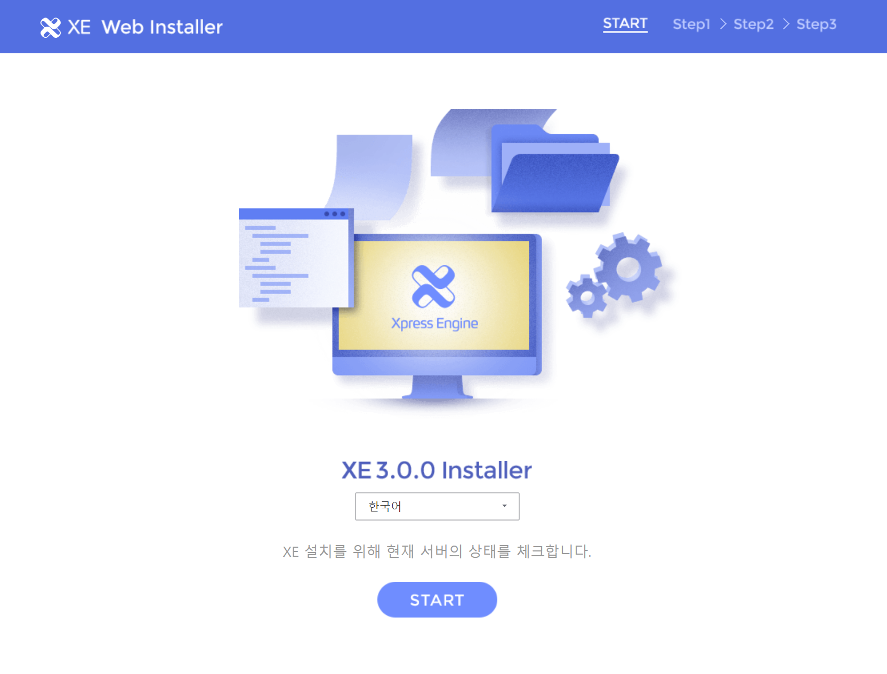
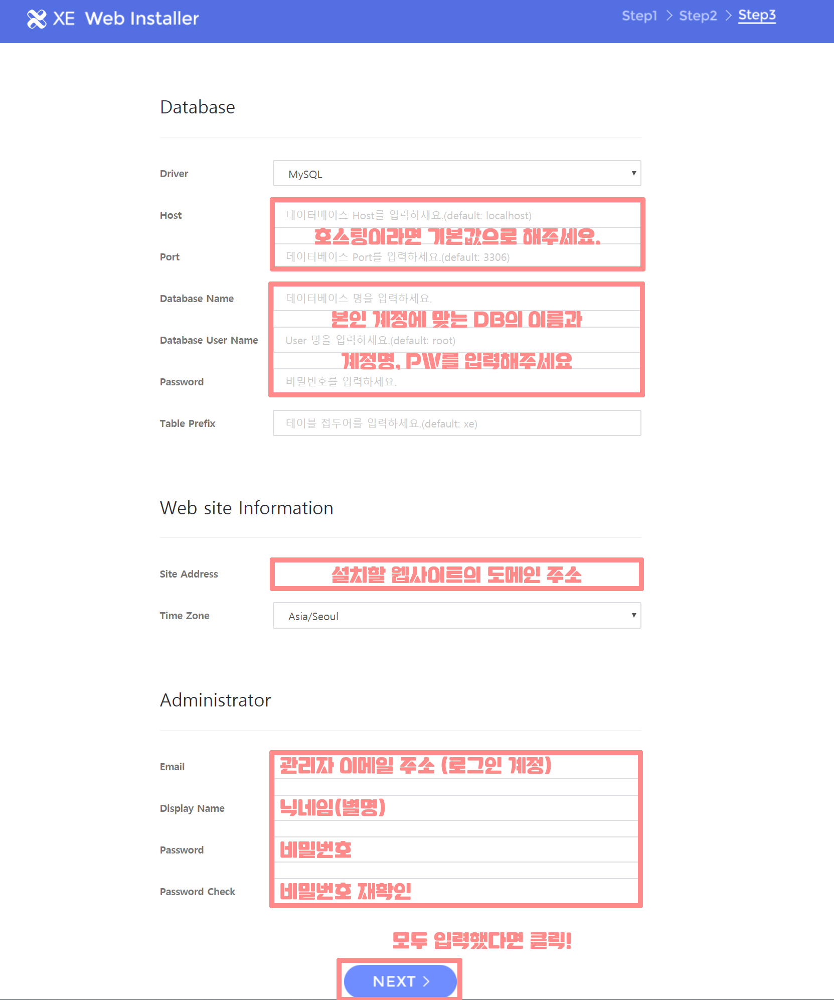

# 설치

## 설치 파일 다운로드

* [http://start.xpressengine.io/latest.zip](http://start.xpressengine.io/latest.zip) 을 [다운로드](http://start.xpressengine.io/latest.zip) 합니다.
* 다운로드 받은 zip 파일의 압축을 풀고 서버에 업로드 합니다. \(약 100MB\)

### 설치 동영상

이해를 위해 짧은 이미지를 준비했습니다.

### FileZila

FTP는 FileZila 를 사용해서 설명합니다. FileZila 는 무료로 사용이 가능한 프로그램 입니다. [다운로드](https://filezilla-project.org/download.php?type=client)

### 디렉토리 권한 설정

#### bootstrap/cache, config/production, storage 폴더 설정

상단의 폴더들을 707 권한으로 변경해주세요.

> 권한 설정할 때 `하위 디렉터리로 이동`, `모든 파일과 디렉터리에 적용` 을 반드시 체크해 주세요.

## 웹 인스톨러 실행

설치할 사이트에 접속하면 인스톨 화면으로 이동됩니다.

웹 서버가 파일을 쓸 수 있도록 권한을 설정합니다.

> 만약 하위 디렉토리에 설치할 경우는 해당 디렉토리로 접속해 주세요.

### 설치 진행하기


DB 접속 정보를 모르거나, 정확히 입력해도 진행되지 않는다면, 사용하고 있는 호스팅 회사에 접속 방법을 문의하시기 바라며, 기본 포트와 호스트, DB 이름과 사용자 계정명이 다를 수 있습니다.


## 알려진 문제점

### FTP의 파일 업로드 오류

파일 업로드 및 디렉토리 설정을 완료하고 웹 인스톨러 접근할 때 오류가 발생하는 경우가 있습니다. 이 문제는 FTP 파일 업로드 중 누락된 파일이 있어 발생할 수 있는 문제 입니다. 해결하기 위해서 FTP로 다시 업로드 해야합니다. 동일 조건을 업로드할 경우 비슷한 오류가 계속해서 발생할 수 있으므로 중복파일 `건너뛰기` 옵션으로 업로드 해보는걸 권장합니다. 

### 웹 서버 타임아웃

서버 성능에 따라 웹 서버 타임아웃 설정에 의해 설치에 실패할 가능성이 있습니다. 이 문제는 사용하고 있는 호스팅 회사 또는 서버 관리자에게 문의하시기 바랍니다.

