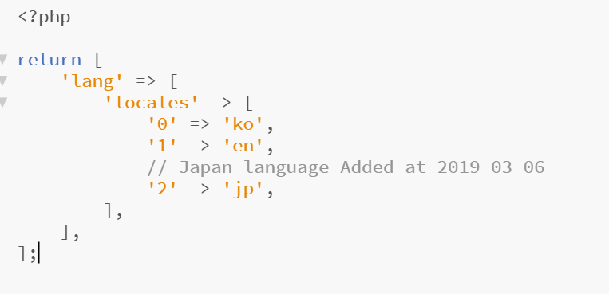
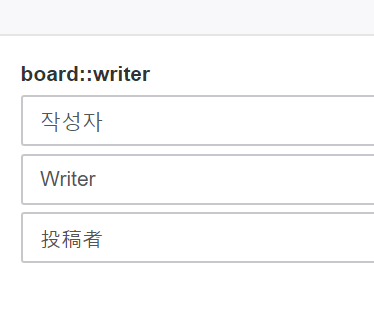

# 다국어 설정

## 다국어 설정이란?

XE3에서는 유연한 다국어 지원을 위해, 기본적으로 한국어와, 영어를 지원하고 있습니다.  
그 이외의 언어를 추가 운영하기 위해서는 하단의 설정을 통해 입력해주세요.

## 다국어 언어 추가하기


XE3 3.0 기준으로 다국어를 웹에서 추가하는 기능은 추가되어 있지 않습니다.  
추후 개선되거나 개발 방향에 의해 진행되지 않을 수 있습니다.


1. FTP를 접속하여 `XE3경로/config/production/xe.php` 폴더를 열고 아래처럼 추가하고 싶은 국가의 언어 코드를 입력해주세요.

2. 관리자 사이트에 접속하여 다국어 &gt; 다국어 설정을 클릭해주세요.  
3. 하단의 이미지 처럼 각 언어에 맞는 언어를 입력 후 각각의 저장버튼을 클릭하면 완료!

